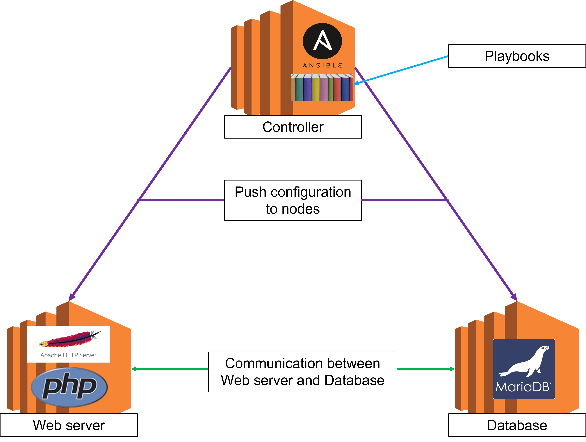

# ansible-kodekloud-project
A repository for learning Ansible with a KodeKloud learning project.

# Manual Set-up
You will need to create at least one Linux VM - the documentation here is for Ubuntu 18.04 on an AWS EC2 instance. The database and the web application can be on the same server or separate ones - the only difference is where you install the dependencies, and the IP addresses that you input during the set-up. Below, we will just use one VM.
## Update and upgrade
1. First, update and upgrade:
```bash
sudo apt-get update -y
```
```bash
sudo apt-get upgrade -y
```
## Database
2. Install MariaDB:
```bash
sudo apt-get install mariadb-server -y
```
```bash
sudo systemctl start mariadb
```
```bash
sudo systemctl enable mariadb
```
3. To create the database, access the mysql terminal with:
```bash
sudo mysql
```
and then:
```sql
CREATE DATABASE ecomdb;
```
```sql
CREATE USER 'ecomuser'@'localhost' IDENTIFIED BY 'ecompassword';
```
```sql
GRANT ALL PRIVILEGES ON *.* TO 'ecomuser'@'localhost';
```
```sql
FLUSH PRIVILEGES;
```
```sql
exit
```
4. You should now have returned to the bash terminal. Create and load the data into the database:
```bash
cat > db-load-script.sql <<-EOF
```
```sql
USE ecomdb;
```
```sql
CREATE TABLE products (id mediumint(8) unsigned NOT NULL auto_increment,Name varchar(255) default NULL,Price varchar(255) default NULL, ImageUrl varchar(255) default NULL,PRIMARY KEY (id)) AUTO_INCREMENT=1;
```
```sql
INSERT INTO products (Name,Price,ImageUrl) VALUES ("Laptop","100","c-1.png"),("Drone","200","c-2.png"),("VR","300","c-3.png"),("Tablet","50","c-5.png"),("Watch","90","c-6.png"),("Phone Covers","20","c-7.png"),("Phone","80","c-8.png"),("Laptop","150","c-4.png");
```
```bash
EOF
```
```bash
sudo mysql < db-load-script.sql
```
## Website
5. Install dependencies:
```bash
sudo apt-get install apache2 -y
```
```bash
sudo apt-get install php -y
```
```bash
sudo apt-get install php-mysql -y
```
6. Ensure default website is set to index.php, and then start apache2:
```bash
sudo sed -i 's/index.html/index.php/g' /etc/apache2/mods-enabled/dir.conf
```
```bash
sudo systemctl start apache2
```
```bash
sudo systemctl enable apache2
```
7. Remove the default apache site and then `git clone` the repository from KodeKloud into the `/var/www/html/` directory:
```bash
sudo rm -rf /var/www/html/index.html
```
```bash
sudo apt-get install git -y
```
```bash
sudo git clone https://github.com/kodekloudhub/learning-app-ecommerce.git /var/www/html/
```
8. Replace the default IP in `index.php` with `localhost` (if using the db on a separate server, use the corresponding IP address):
```bash
sudo sed -i 's/172.20.1.101/localhost/g' /var/www/html/index.php
```
9. Head to IP address of your server to view the website.

## Ansible
